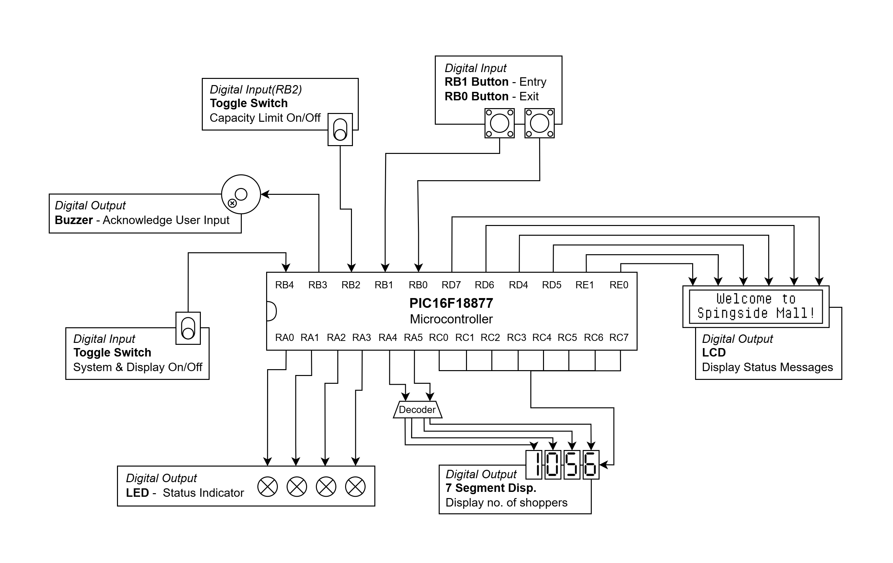
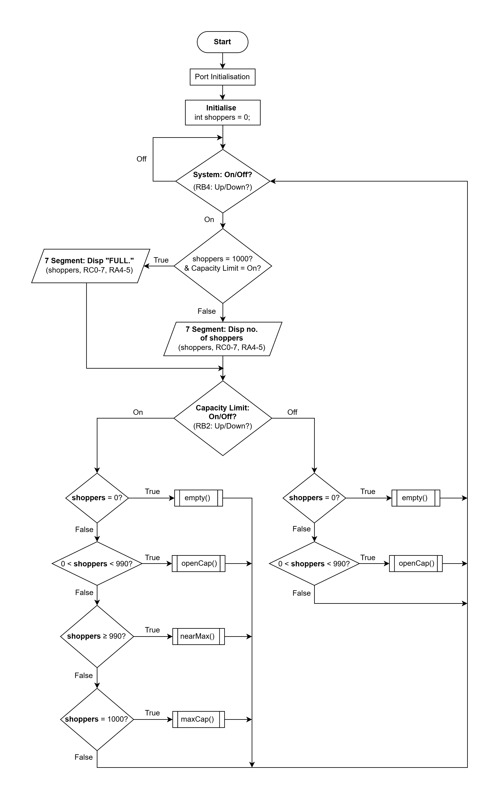
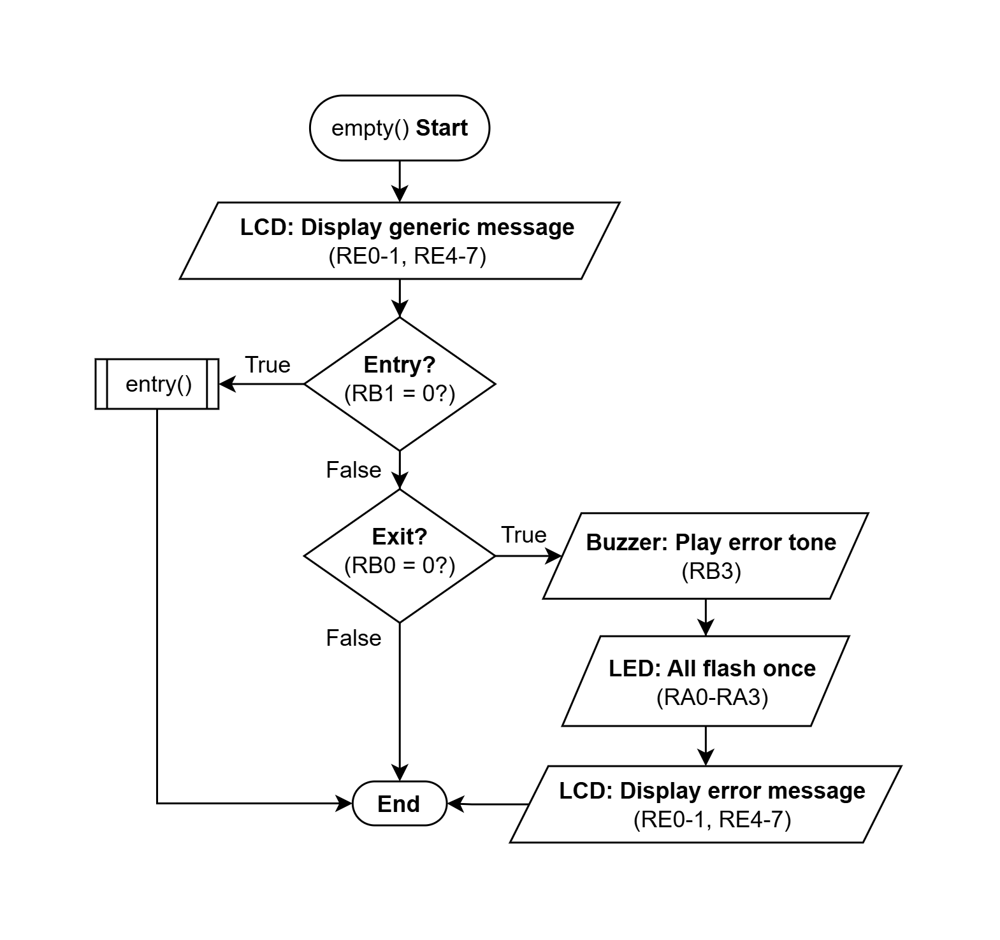
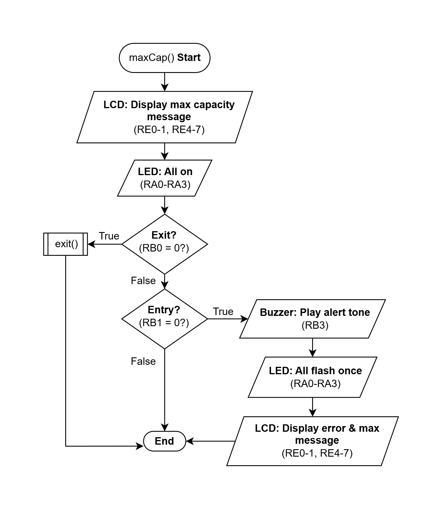
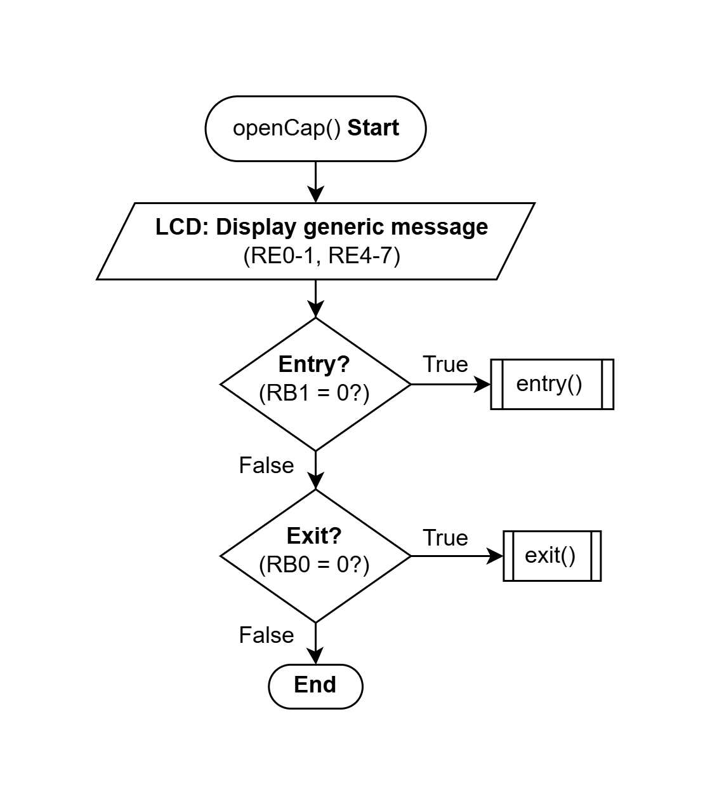
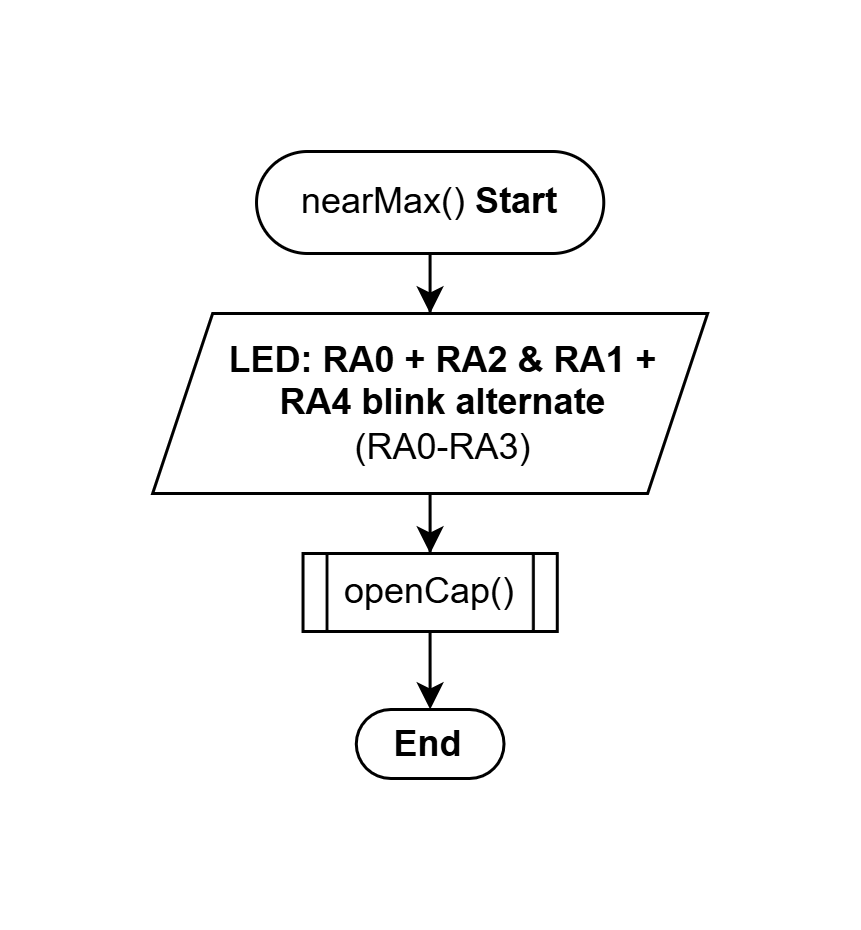
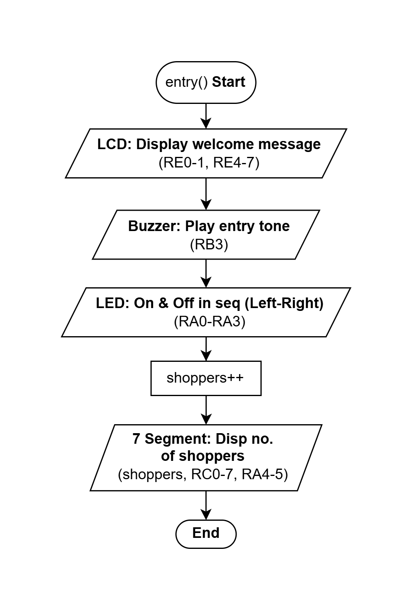
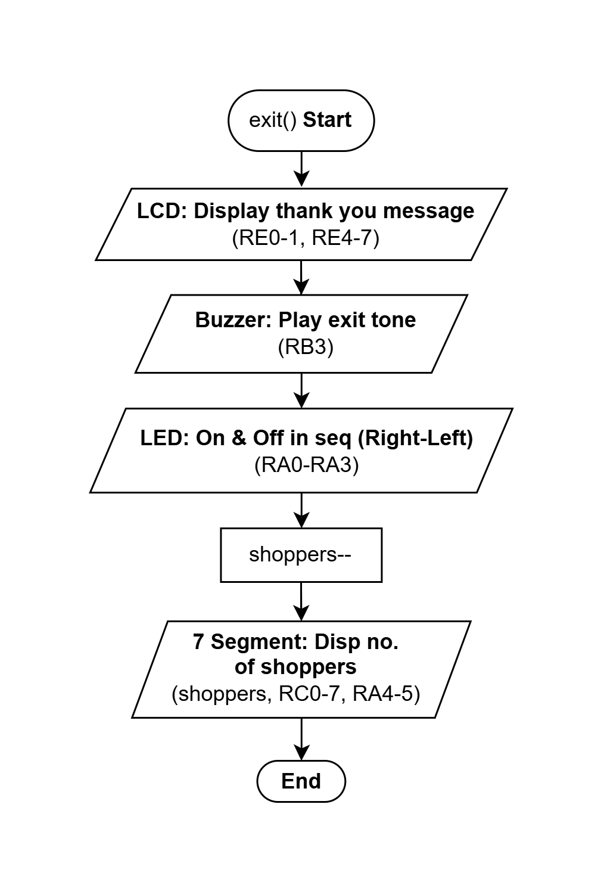

# Smart Mall Entry

This project was developed using MPLAB X IDE.

## The Problem

A shopping mall owner needed to control the number of shoppers in the mall to adhere to safe distancing guidelines due to COVID-19. He needed a way to always monitor the number of shoppers and to limit that number to a specific capacity.

## The Proposed Solution

The proposed solution was to create a system that could record and display the number of shoppers moving in and out of a shopping mall. With that data, the program can limit the number of shoppers in the mall at any time, to adhere to COVID-19 guidelines & create a safer environment for all. 

The system makes use of an interactive interface with buttons, switches, LEDs, LCD display, 7 segment module and a buzzer.  

The toggle switches can turn on/off the main program (RB4) and the shopper capacity limit (RB2). This allows the mall owner to utilise the system whenever he requires and track the no. of people in the mall even after COVID-19 restrictions are lifted as the system would not limit the entries then.   

Shoppers can press either the exit (RB1) or entry (RB0) button when they move in/out. This will send instructions to the program to update the current no. of shoppers on the 7 segment panels. The LEDs would light up sequentially and the buzzer will sound to acknowledge their input. The LCD would display a relevant message.   

When the total number of shoppers is close to the programmed limit, the LEDs will blink to inform shoppers of the current capacity. Once the limit has been reached, the system will disallow entries and the 7 segment module will update to display “FULL”. All the LEDs will be turned on until the no. of shoppers decreases and falls below the limit. If a shopper pressed the entry button, then, the buzzer would sound an alert, the LEDs will flash once, and the LCD will display an error message. A similar response will be produced if a shopper pressed the exit button when the mall is empty, and the shopper count is already at 0. 

## Port Pin Assignment

| **Port** | **Function** | **In/Out** | **Description** |
|-----------|--------------|------------|-----------------|
| **RB4** | System Switch | In | Switch on/off all system processes & displays |
| **RB2** | Capacity Limit Switch | In | On/Off to bypass the shoppers limit allowed & the maximum capacity warning system |
| **RB1** | Entry Button | In | Will +1 to **shoppers** when button is pressed to record an entry to the shopping mall |
| **RB0** | Exit Button | In | -1 from **shoppers** when button is pressed to record an exit from the shopping mall |
| **RA<3:0>** | Red LEDs | Out | Indicate near max (alternate blinking) & max capacity (all On), entry/exit (sequential On/Off) and error (all flash once) |
| **RB3** | Buzzer | Out | Play 4 unique tones to acknowledge user input for entry, exit, error and warning at max capacity |
| **RA<5:4>** | 2-to-4 Decoder (7 Segment Disp.) | Out | Turn on/off 7 segment displays individually |
| **RC<7:0>** | 7 Segment Display | Out | Display the no. of shoppers at all times and “FULL” at max capacity when the limit is On |
| **RE<1:0>** | LCD Control Lines | Out | Turn on/off LCD display & receive instructions on how to process data sent through the data lines |
| **RD<7:4>** | LCD (Data Lines) | Out | Display messages to shoppers after entry, exit, error, max capacity is hit (when limit is on) and generic message at all other times |

## Block Diagram

## Flowcharts

#### main

#### empty()

#### maxCap()

#### openCap()

#### nearMax()

#### entry()

#### exit()

## Reflection

This project allowed us to be creative with our solutions while implementing all the things we had learnt over the past term. It was interesting to compare its similarities to Python (which we learnt last semester) and its differences & limitations as well. I had decided to write our program across multiple source files, so that debugging would become easier when we need to look for errors. In C language, the function declarations & variable/constant definitions can get confusing, if they are not organized properly across all the source files. However, this gave me an opportunity to problem-solve outside of what we had learnt in class and learn something new, like how to define global variables in C language. It also put my organizational skills to test. 

In our program, I realized the target board had one limitation. We could not have the 7 segment panels run continuously while also running blinking LED lights. The 7 segment panels would flicker whenever the LED lights blinked, as the target board only allowed for 1 panel to be lit at anytime. So, any interruption in the code would cause a visible disturbance. In order to fix this, we modified our code to use a static LED pattern instead so that the 7 segment panel could run without interruption. 
